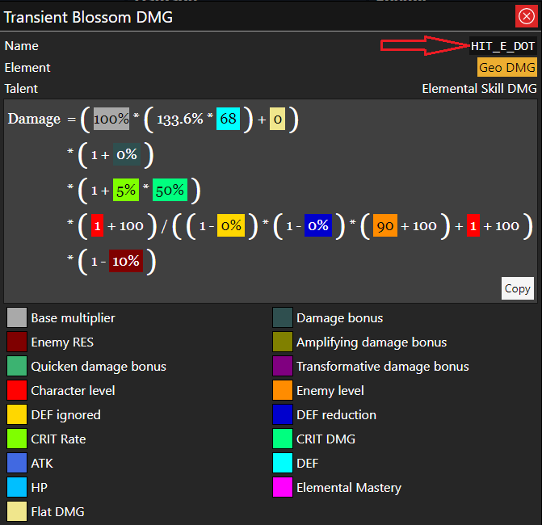
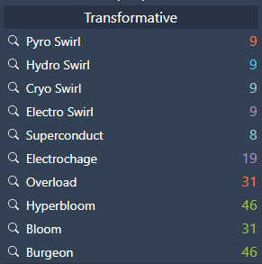

# Writting rotations

Rotations have to be **declared explicitly**. This means that no consequences 
or side-effects will be automatically assumed by the calculator. If using 
a normal attack with a character triggers Xingqiu elemental burst, you will
have to declare the hit of the normal attack **and** the hit of Xingqiu's
elemental burst.

This also means that the rotations are **static**. Buffs involving changes in
the rotation such as attack speed or an increase in the number of attacks
will not be automatically considered.

## 1. Casting attacks
To declare any character attack, use the command `rotation hit` as follows:
```js
rotation hit Xingqiu Q *60
//              ^    ^   ^
//              1    2   3
// 1: Character name
// 2: Instance (attack) name
// 3: Multiplier
```
The multipliers are optional, you can insert the amount you want, separated by spaces
but always with the `*` symbol at the left, for example:
```js
rotation hit Xingqiu Q *37 *1.21 *1.33 // three multipliers
```

You can find the name of all instances by running the command `character damage` in the console, or in the application by clicking in the lens icon of a damage instance:



You **don't** have to include the `HIT_` prefix in the command.

So you could write something like this:
```js
// a rotation for albedo
rotation hit Albedo E // Skill cast damage
rotation hit Albedo E_DOT *7 // 7 instances of transient blossom
rotation hit Albedo Q // burst cast damage
rotation hit Albedo Q_DOT *3 // 3 instances of fatal blossom
```

## 2. Elemental reactions
In this document, we'll consider as "amplifying reaction" any reaction that increases the damage of an attack, and "transformative reaction" to  the reactions that creates a different damage instance without modifying the character damage.

under this definition, Melt, Vaporize, Aggravate and Spread are amplifying reactions, while Bloom, Hyperbloom, Burgeon, Burning, Overload, Electrocharge, Swirl, Superconduct and Shatter.

**Note 1:**  Superconduct reaction consists in two parts: a cryo damage instance which scales up with elemental mastery, and a debuff effect for the enemy. These parts are **separated** and, as mentioned before, they're no automatical side effects: casting superconduct damage with `rotation hit` **will not** apply the superconduct effect automatically.

**Note 2:** Swirl is not considered as a single damage instance, but as different instances, one by element. You can find those instances in any anemo character, by running `character damage` in the console or in the Attributes section of the application.



### 2.1. Transformative reactions

You can add transformative reactions as normal damage instances, for example:
```js
rotation hit Fischl Oz
rotation hit Xiangling Pyronado
rotation hit Xiangling Overload
```
In this case, the overload is **triggered by Xiangling**.

Again, no elemental auras or side effects will be applied with this.

Note that cyro swirls can also trigger Melt, and electro swirls can trigger Aggravate. This will be covered in the next section.

### 2.2. Amplifying reactions
These reactions will be applied to the damage calculation of a instance if the enemy is affected by an elemental aura that allows them to be generated.

An enemy affected by pyro will allow cryo attacks to trigger melt, and hydro attacks to trigger vaporize. For example:
```js
// affect enemy with pyro
rotation do enemy aura pyro 
rotation hit Ayaka E // a cryo attack will trigger Melt
rotation hit Mona Q // a hydro attack will trigger Vaporize

// remove pyro from enemy
rotation do enemy aura none 
rotation hit Ayaka E // won't melt
rotation hit Mona Q // won't vaporize
```
_(We will explain more about `rotation do` later on this document)_

- You can apply multiple auras to the enemy with no restriction by using commands.

- In the calculator, the reaction with the highest multiplier always have priority, so if the enemy is affected by both cryo an hydro, attacking it with pyro will trigger melt, not vaporize.

- The elemental aura that allows Aggravate and Spread to be triggered is `QUICKEN`.

- Quicken aura counts as dendro, and frozen aura counts as cryo.

### 2.2.1. Aura uptime
Is not always possible to keep the enemy affected by elemental auras all the time. Sometimes it's lost due to triggering certain reactions or other factors like the enemy/domain being affected by special effects, or simply gameplay mistakes.

To represent this behaviour, you could just do the following:
```js
// enemy affected by pyro
rotation do enemy aura hydro
rotation hit Xiangling Pyronado // triggers vaporize

// enemy NOT affected by pyro
rotation do enemy aura none
rotation hit Xiangling Pyronado // DOES NOT tigger vaporize
```
This will represent _"one pyronado hit triggering vaporize from a total of 2 hits"_.

However, there is a simpler way to do this, by introducing the concept of **aura uptime**.

This is a value between 0 and 100% that means: "for what percentage of the hits the enemy will be affected by the aura".

> You can read about the maths behind these values [here](./rotations_model.md).

As an equivalent to the previous example, you could set this value once per hit as follows:
```js
rotation do enemy aura hydro
rotation hit Xiangling Pyronado aura=50%
```
Which means that "the 50% of pyronado attacks will hit the enemy affected by hydro".

- Note that `50%` is equivalent to `0.5`, you can use both formats.

- By default, the value of the aura uptime is 100%.

> You can read about the maths behind these values [here](./rotations_model.md).