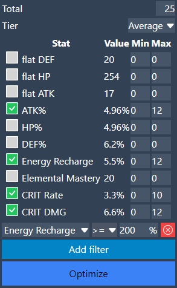
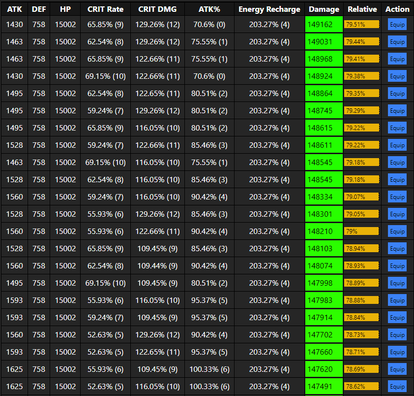
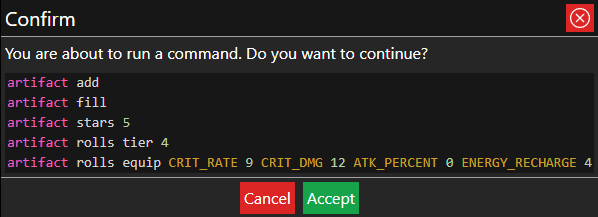

# Substats optimizer

This tool will evaluate all the different ways to distribute a given amount of rolls between a group of substats, finding the combination with the highest damage.

- **Total:** the number of rolls to distribute between substats.
- **Tier:** Which substat values to use. Tier 1 substats are commonly called min rolls, while Tier 4 substats are max rolls. There's also an additional tier, which is the average of all the 4 values.

You can select different substats to optimize, each of them with an specific range of `[min, max]`. For performance reasons, the limit of substats that can be selected is 5. Also, the maximum rolls is 45, and the maximum rolls per substat is 30.

Add filters to constraint minimum or maximum values for any character stat. This can be used, for example, to optimize considering a energy recharge requirement. You could also set a minimum of crit rate/dmg in order to skip more combinations and increase the performance.

A sample configuration would look like this:

**Notes:**
- The more rolls or substats to optimize, the more combinations will need to be evaluated, slowing down the process.
- This optimizer will always assume 5-star artifacts. If your target character has 4-stat artifacts equiped, they will be converted to 5-star before running the calculations. Characters in the party different to the target will not be affected.

When the configuration is ready, click on the **"Optimize"** button and wait to the process to end.

## Results
Once the process is done, you will get a table that looks like this:

Each row of the table is a combination os substats with its final values (**before** running the rotation code), and the calculated damage.

The relative value is calculated based on your **initial** damage, with the artifacts you have configured in the application.

If you want to load a result to the application, click on the **"Equip"** button and you'll get a confirmation like this:

Just click on **"Accept"**.

All optimizer results are equipped through commands. If you want to read more about commands, [click here](../../cmd/index.md).